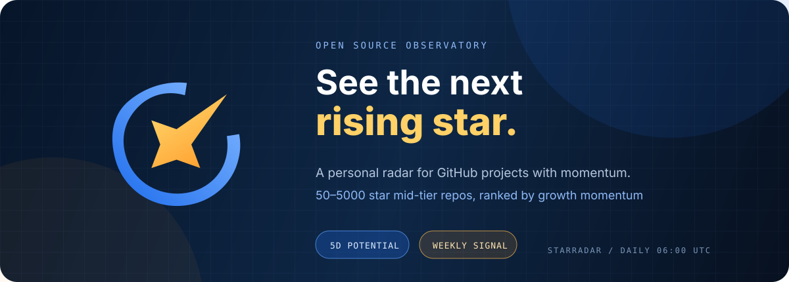
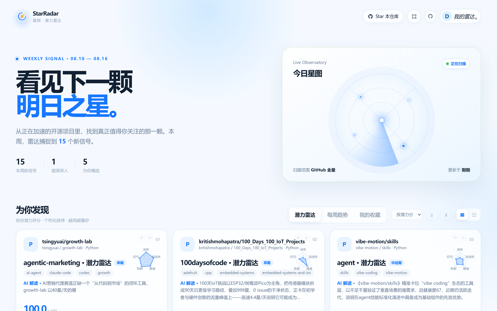

<p align="center">
  <a href="README.md">中文</a> · <b>English</b>
</p>

<p align="center">
  
</p>

<p align="center">
  
  
  
  
  
  
</p>

---

## Positioning

By the time a project hits GitHub Trending, the hype has already been captured. StarRadar works the other way around — it targets **50–5000 star "mid-tier candidates"** and measures *who is taking off* by growth momentum, not *who is already the biggest*.

| Traditional trending | StarRadar |
| --- | --- |
| Sorted by total stars, giants dominate | Sorted by **growth momentum**, newcomers first |
| Only tells you "it got popular" | Tells you **why it deserves attention** (AI explanations) |
| One size fits all | Questionnaire + behavior memory + personalized picks |

> **Core idea**: stars alone mean nothing — growth momentum does. Giants that fail to outpace their own size class never make the StarRadar board.

---

## Two editions

| | **Public edition** (for everyone) | **Personal edition** (for yourself) |
| --- | --- | --- |
| Mission | Objective discovery: one shared board, ready out of the box | Personalized picks: searched & interpreted only for you |
| Entry | GitHub Pages / local `--serve` | "Personal ↗" in the top-right (`?personal=1`, run locally) |
| Potential board | 5D potential score (objective size-class baseline, same for all) | Profile-driven search × 5D scoring × personalized interpretation |
| Weekly trends | TrendScore v2 momentum board (objective) | Same objective board + "this week's themes" interpreted for your profile |
| Cold start | No questionnaire, use immediately | Mandatory questionnaire (40 tags → cold-start profile) |
| AI interpretation | Rule-based (momentum / signal / stage) | LLM edition: bring your own Key — interpretations, reasons, weekly report all generated from your profile |
| GitHub sign-in | A tool (star / fork / clone) | Required (fetches "my starred" as seed) |
| Data updates | GitHub Actions: daily 06:00 / weekly Monday 08:00 auto-deploy | Local server **auto-generates daily** + "Refresh data" button for on-demand refresh |
| Data | Anonymous stats, no personal data uploaded | Profile + behavior memory + snapshots (local only) |

> In one line: the public edition answers "**which projects are taking off this week**", the personal edition answers "**which projects fit me**". The two editions run completely different ranking & interpretation mechanisms.

**Why two separate mechanisms**: the public edition is about credibility — the board must be identical for everyone to discuss, quote and share, so no questionnaire and no personalization; the personal edition is about knowing you — your profile (questionnaire + starred repos + behavior memory) drives search and interpretation. A thousand people, a thousand boards — that is the feature, not a flaw.

---


## Quick start

```bash
git clone https://github.com/2BingLing/StarRadar.git
cd StarRadar
pip install -r requirements.txt
cp .env.example .env        # GITHUB_TOKEN required; LLM_* optional (any OpenAI-compatible endpoint)

python src/main.py --serve  # local observatory → http://127.0.0.1:8970/
python src/main.py          # daily pipeline: collect → score → profile → explain → JSON
python src/main.py --weekly # build / refresh the weekly trend report
python src/main.py --personal  # personal pipeline (usually not needed manually — server auto-generates daily + refresh button)
pytest                      # 150 passed
```

---
## Personal edition quick start

```
① Run python src/main.py --serve → open http://127.0.0.1:8970/?personal=1
② Click "Sign in with GitHub" → enter the 8-digit code once (zero config, token stays local)
③ Complete the cold-start questionnaire (guided wizard: 40 tags → star range → AI personalization optional)
④ Data generates automatically: server runs the pipeline daily at 06:00; click "⇄ Refresh data" anytime for on-demand refresh (progress dialog)
⑤ Done ✓ — your personal radar is live and updates daily
```

**Questionnaire, two forms**:

- **First-time wizard** (auto-pops on first visit): guided 4-step flow — left rail (domains → size → AI → done) + right content; 40 hot 2026 tags (multi-select, max 8) + flexible star range (any / 50+ / 100+ / 500+ / 1000+ × any / 1000 / 5000 / 10000 below)
- **Edit panel** (via "My Radar"): compact editor — remove/add selected tags (＋ add domains popup), star range, LLM Key all on one screen; **changes take effect on the next generation**

**AI personalization (optional, STEP 3 or edit panel)**: bring your own LLM Key (OpenAI / DeepSeek / Zhipu / Qwen one-click presets; OpenAI-compatible endpoints only) → auto-tested before saving → explanations / recommendation reasons / weekly report all generated from your profile. No key = rule mode.

**Data guarantees**:

- Questionnaire is stored **twice** — browser localStorage + local backend memory.db; if browser storage is lost (new browser / cleared data) it auto-restores from the backend, no re-filling
- The top bar shows two **independent timestamps** — "radar updated X ago · weekly updated Y ago"; a stale banner appears after 2 days
- Personal data lives only in local `data/` (gitignored, never in the repo or on Pages)

---

## Screenshots

<p align="center">
  
</p>

<table>
  <tr>
    <td align="center" width="50%" style="padding:0 10px">
      
      <br><sub>Weekly trends · momentum board</sub>
    </td>
    <td align="center" width="50%" style="padding:0 10px">
      
      <br><sub>Potential radar · 5D scoring</sub>
    </td>
  </tr>
</table>

---

## Core capabilities

| Capability | Description |
| --- | --- |
| **Daily potential radar** | Multi-bucket sampling across 3 star ranges (50-200 / 200-1000 / 1000-5000), noise filtering (courses / lecture notes / mirrors); 5D scoring: velocity · acceleration · community health · freshness · signal, benchmarked against peers of similar size |
| **Weekly trend report** | TrendScore v2 momentum ranking: growth 40% + novelty 20% + accel 15% + excess 10% + topic 10% + health 5%; momentum ticket gate keeps giants off the board; four sections: new stars / hot TOP / domain trends / my follows, with cross-week tracking and status badges |
| **Personalized picks** | Personal edition only: questionnaire → cold-start profile → profile-driven search + behavior EMA (α=0.3) incremental updates + forgetting curve, daily personalized recommendations (better the more you use it) |
| **AI Chinese explanations** | Each listed project gets a "why it deserves attention" note, incrementally cached (regenerated only when stars change >20%), gracefully falling back to rule text; in the personal edition you can bring your own LLM Key so explanations / reasons / weekly report are all generated from your profile |
| **GitHub native integration** | One-click login (OAuth device flow, zero config; upgradable to redirect login) → star, fork, copy clone command and take notes right on the page |
| **Fully automated pipeline** | Public: daily 06:00 collect → score → explain → snapshot → deploy Pages, weekly report Monday 08:00; Personal: local server **auto-generates daily at 06:00** + startup catch-up + one-click refresh |

---

## 5D potential scoring

<p align="center">
  
</p>

All five dimensions are measured against a **dynamic baseline of same-size projects**, not absolute values — a rising mid-tier project can outscore a giant a hundred times its size.

---

## Personalization loop

Data flow: browser (localStorage) → local `--serve` persistence (SQLite) → daily pipeline rebuilds your profile → generates picks.

| Layer | Scope | Depends on backend data |
| --- | --- | --- |
| Browser real-time layer | Potential board ordering, "relevant to you" badges, category tags | No (questionnaire + behavior computed instantly in your browser) |
| Backend long-term layer | Personalized picks, cross-device memory, daily rebuild | Yes (questionnaire / behavior must reach memory.db) |

**How the long-term layer becomes active**: run `python src/main.py --serve` locally and open the page — it auto-syncs everything after ~8 seconds (the footer "Sync data" button also works manually). CI then rebuilds your picks daily with the freshest profile. If you only browse GitHub Pages and never sync, the long-term layer stays at the last synced profile (the browser real-time layer is unaffected).

**Personal edition full loop**: questionnaire (wizard / edit panel) → saved to localStorage + reported to memory.db (auto-restored if browser storage is lost) → the local server runs the pipeline daily at 06:00 (profile-driven search → 5D scoring → LLM personalized interpretation) → overwrites your personal radar data → visible on refresh.

---

## Sign-in mechanism & permissions

"Sign in with GitHub" uses the **OAuth Device Flow** (the Client ID is bundled as a public value — zero configuration for anyone who clones):

1. Click sign in → GitHub asks for an 8-digit code → authorize once
2. The GitHub-issued token returns directly to **your browser and stays local** (localStorage; the personal pipeline also keeps a copy in a local file to fetch "my stars / my repos")
3. The scopes shown on the authorization page are `public_repo` (star / fork public repos) and `read:user` (read your username and avatar)

**Safety boundaries**:

- **The token never passes through any third party** — not the author's server, not the hosting platform, not a public proxy; on GitHub Pages (no backend) the token stays in your browser only
- **The bundled Client ID is a public value** (not a secret, no risk); the Client Secret is never bundled or committed — GitHub auto-revokes any publicly leaked secret, which is exactly why sign-in uses device flow instead of an embedded-secret redirect
- **The app only calls**: star/unstar, fork, and reading your starred/repo info. It never uses your token for anything else (no code changes, no private repos, no other apps)
- **Sign out anytime**: the page's "Sign out" clears the local token instantly; you can also revoke at GitHub → Settings → Applications → StarRadar and the token dies immediately
- **No data uploads**: questionnaire / behavior data is only persisted locally via `--serve` (memory.db); the GitHub Pages deployment contains no personal data
- **LLM Key is personal-edition only**: the Key you enter circulates only on your machine (browser localStorage + local backend `data/profile/llm_config.json`), used by the daily pipeline to call the service you specify for personalized interpretations; the public edition never touches it and nothing goes to any third party

> Want the one-click "authorize & bounce back" website experience? Register your own OAuth App and set `GH_OAUTH_CLIENT_ID / GH_OAUTH_CLIENT_SECRET` in your local `.env` — sign-in auto-upgrades to the redirect flow (callback URL `http://127.0.0.1/api/oauth/callback`).

---

## Structure / tech stack

| Layer | Contents |
| --- | --- |
| src/ | collector · analyzer · profile (profile / recommendations) · reporter (reports / LLM explanations) · search (semantic search) · web (local server + OAuth) |
| static/ | GitHub Pages frontend (vanilla JS, zero frameworks): index.html · js/ · css/ · data/ (CI-generated JSON) |
| data/profile/ | memory.db (questionnaire + behavior + snapshots) + interests.json (interest profile) |
| .github/ | daily.yml daily refresh · weekly.yml Monday report · Pages deployment |
| Backend | Python 3.10+ · SQLite · numpy · scikit-learn · BGE embeddings · HNSW · BM25 |
| Automation | GitHub Actions (free unlimited minutes on public repos) |

---


## License

[GNU Affero General Public License v3.0](LICENSE) — free to use and modify, but **derivative works and network services based on this project must be open-sourced under AGPL as well**.

---

<p align="center">
  
  <br>
  <sub>Your private star map, refreshed weekly · StarRadar</sub>
</p>
