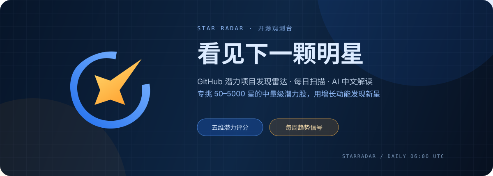
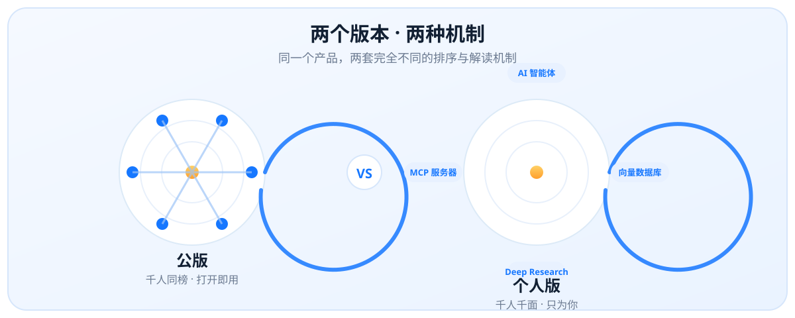
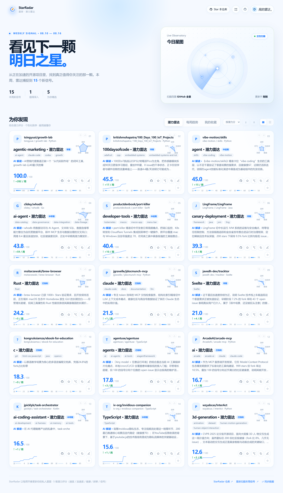
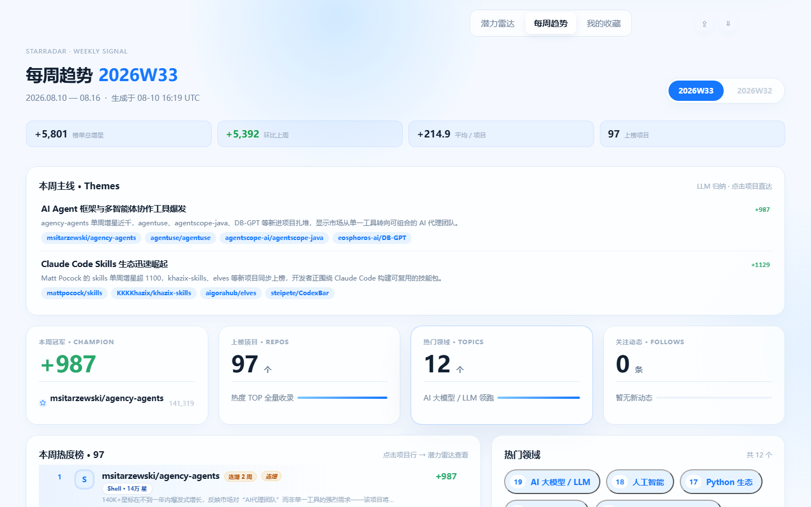
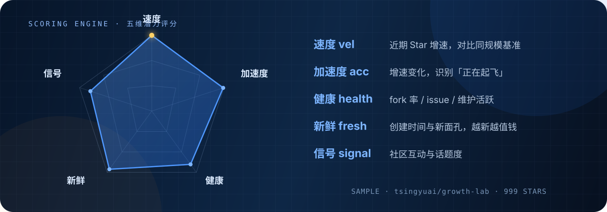
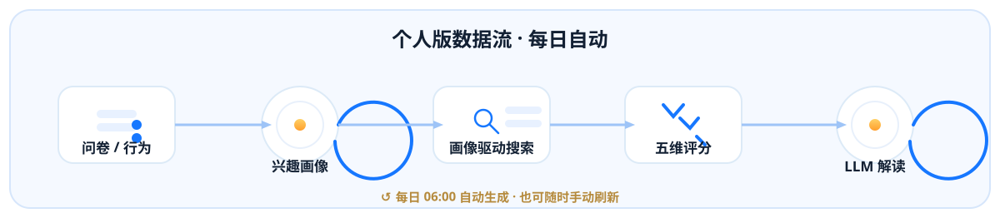

<p align="center">
  <b>中文</b> · <a href="README.en.md">English</a>
</p>

<p align="center">
  
</p>

<p align="center">
  
  
  
  
  
  
</p>

---

## 定位

GitHub Trending 上榜时，热度红利早已被瓜分。StarRadar 反着来——专挑 **50 ~ 5000 星**的「中量级潜力股」，用增长动能量化「谁正在起飞」，而不是「谁已经最大」。

| 传统热门榜 | StarRadar |
| --- | --- |
| 按 Star 总数排序，巨无霸霸榜 | 按**增长动能**排序，新面孔优先 |
| 只告诉你「它火了」 | 告诉你「它**为什么值得关注**」（AI 解读） |
| 千人一面 | 公版客观同榜 / 个人版千人千面，两套机制 |

> **核心理念**：星数无意义，增长动能才上榜。跑不赢同规模常态增速的巨无霸，进不了 StarRadar 的榜。

---

## 两个版本 · 两种机制

<p align="center">
  
</p>

**StarRadar 是一个产品，两个版本**——公版回答「这周哪些项目在起飞」，个人版回答「哪些项目适合我」。排序、推荐、解读机制完全不同：

| | **公版**（给大家看） | **个人版**（给自己看） |
| --- | --- | --- |
| 定位 | 客观潜力发掘：同一份榜单，打开即用 | 专属雷达：只为你搜索与解读 |
| 入口 | GitHub Pages / 本地 `--serve` | 右上角「个人版 ↗」（`?personal=1`，本地运行） |
| 潜力雷达 | 五维潜力分排序（客观动态基准，**千人同榜**） | 画像驱动搜索 × 五维评分 × 个性化解读（**千人千面**） |
| 每周趋势 | TrendScore v2 增长动能周榜（客观） | 同一份客观榜单 + 按你的画像解读「本周主线」 |
| 冷启动 | 无问卷，打开即用 | **问卷强制引导**（40 标签 → 冷启动画像） |
| AI 解读 | 数据规则版（增速 / 信号 / 阶段） | **LLM 版**：填你自己的 Key，解读 / 推荐理由 / 周报全部按画像生成 |
| GitHub 登录 | 工具（加星 / Fork / 克隆） | 必需（拉取「我的加星」作为种子） |
| 数据更新 | GitHub Actions 每日 06:00 / 每周一 08:00 自动部署 | 本地服务**每日自动生成** + 页面「刷新数据」随时手动触发 |
| 数据 | 匿名统计，不上传个人数据 | 画像 + 行为记忆 + 快照（仅存本机） |

**为什么是两套机制**：公版的核心是「公信力」——榜单必须对所有人一致才能被讨论、引用、转发，所以无问卷、无个性化；个人版的核心是「懂你」——画像（问卷 + 我的加星 + 行为记忆）驱动搜索与解读，千人千面是特性不是缺陷。

---


## 快速开始

```bash
git clone https://github.com/2BingLing/StarRadar.git
cd StarRadar
pip install -r requirements.txt
cp .env.example .env        # GITHUB_TOKEN 必填；LLM_* 可选（DeepSeek 等 OpenAI 兼容端点）

python src/main.py --serve  # 本地观测台 → http://127.0.0.1:8970/（个人版 ?personal=1）
python src/main.py          # 每日管道：采集 → 评分 → 画像 → 解读 → 生成 JSON
python src/main.py --weekly # 生成 / 刷新每周趋势周报
python src/main.py --personal  # 个人版管道（一般不需要手动跑——server 每日自动 + 页面刷新按钮）
pytest                      # 150 passed
```

---
## 个人版上手

```
① 运行 python src/main.py --serve → 打开 http://127.0.0.1:8970/?personal=1
② 点「通过 GitHub 登录」→ 输一次 8 位授权码（零配置，Token 只存本机）
③ 完成冷启动问卷（引导式向导：40 标签 → 体量区间 → AI 个性化可选）
④ 数据自动生成：服务开着每天 06:00 自动跑；想立即刷新点「⇄ 刷新数据」（弹窗实时进度）
⑤ 完成 ✓ —— 你的专属雷达上线，每天自动更新
```

**问卷双形态**：

- **初次填写**（首次打开自动弹出）：引导式 4 步向导——左步骤条（领域 → 体量 → AI 个性化 → 完成）+ 右内容区；40 个 2026 热门标签多选（上限 8）+ 灵活体量区间（不限 / 50+ / 100+ / 500+ / 1000+ × 不限 / 1000 / 5000 / 10000 以下）
- **再次修改**（点「我的雷达」）：紧凑编辑面板——已选标签直接增删（＋添加领域弹层）、体量、LLM Key 一屏改完；**改动在下一次生成时生效**

**AI 个性化（可选，STEP 3 或修改面板）**：填入你自己的 LLM Key（OpenAI / DeepSeek / 智谱 / 通义 一键预设，仅支持 OpenAI 兼容接口）→ 保存前自动测试连通 → 解读 / 推荐理由 / 周报全部按你的画像生成。不填则规则模式。

**数据保障**：

- 问卷保存在浏览器 localStorage + 本地后端 memory.db **双份**——浏览器存储丢失（换浏览器 / 清理）自动从后端恢复，不重填
- 顶部数据条显示「雷达更新于 X · 周报更新于 Y」两个**独立时间**；超过 2 天未更新提示过期
- 个人版数据只存本机 `data/`（gitignore，不进仓库、不上 Pages）

---

## 界面

<p align="center">
  
  <br>
  <sub>首页 · 今日星图 + 潜力雷达（五维评分）</sub>
</p>

<p align="center">
  
  <br>
  <sub>每周趋势 · 增长动能周榜</sub>
</p>

## 核心能力

| 能力 | 说明 |
| --- | --- |
| **每日潜力雷达** | 3 个 Star 区间（50-200 / 200-1000 / 1000-5000）多桶采样，过滤课程 / 课件 / 镜像噪声；五维评分：速度 · 加速度 · 社区健康 · 新鲜度 · 信号，动态基准对比同规模项目 |
| **每周趋势周报** | TrendScore v2 增长动能排序：growth 40% + novelty 20% + accel 15% + excess 10% + topic 10% + health 5%；增速门票制，巨无霸不进榜；新星 / 热度 TOP / 领域走势 / 我的关注四大板块，跨周追踪 + 状态徽章 |
| **为你精选** | 个人版专属：问卷 → 冷启动画像 → 画像驱动搜索 + 行为 EMA（α=0.3）增量更新 + 遗忘曲线，每日生成专属推荐（越用越准） |
| **AI 中文解读** | 每个上榜项目生成一段「为什么值得关注」中文解读，增量缓存（星数变化 >20% 才重读），失败自动降级规则文本；个人版可填自己的 LLM Key，解读 / 推荐理由 / 周报全部按你的画像生成 |
| **GitHub 原生集成** | 一键登录（OAuth 设备流零配置 / 可升级跳转授权）→ 网页内直接加星 · Fork · 复制克隆命令 · 随行笔记 |
| **全自动管线** | 公版：每日 06:00 采集 → 评分 → 解读 → 快照 → 部署 Pages，每周一 08:00 周报；个人版：本地服务**每日 06:00 自动生成** + 启动补跑 + 页面一键刷新 |

---

## 五维潜力评分

<p align="center">
  
</p>

五个维度都以**同规模项目的动态基准**为参照，而非绝对值——「正在起飞」的中量级项目，评分可以高过百倍体量的老牌仓库。

---

## 个性化闭环

<p align="center">
  
</p>

数据流：浏览器（localStorage）→ 本地 `--serve` 落库（SQLite）→ 每日管道重算画像 → 生成专属推荐。

| 层 | 生效范围 | 是否依赖后端数据 |
| --- | --- | --- |
| 浏览器实时层 | 潜力雷达排序、「与你相关」标记、分类标签 | 否（问卷 + 行为在本机浏览器即时计算，打开页面立即生效） |
| 后端长期层 | 「为你精选」、跨设备记忆、每日重算 | 是（需问卷 / 行为已进入 memory.db） |

**个人版的完整链路**：问卷（初次向导 / 修改面板）→ 保存到 localStorage + 上报 memory.db（浏览器存储丢失自动恢复）→ 每日 06:00 本地服务自动跑管道（画像驱动搜索 → 五维评分 → LLM 个性化解读）→ 覆盖个人雷达数据 → 页面刷新即见。

---

## 登录机制与权限说明

「通过 GitHub 登录」采用 **OAuth 设备流**（Client ID 已内置为公开值，克隆者零配置）：

1. 点击登录 → 打开 GitHub 页面输入 8 位授权码 → 确认授权
2. GitHub 签发的 token 直接回到你的浏览器，**仅存本机**（localStorage；个人版本地管道会另存一份到本地文件，用于拉取「我的加星 / 我的仓库」）
3. 授权页展示的权限为 `public_repo`（对公开仓库加星 / Fork）与 `read:user`（读取用户名与头像）

**安全边界**：

- **Token 不经过任何第三方**——不经作者服务器、不经托管平台、不经公共代理；GitHub Pages 在线版（无后端）时 token 只在你的浏览器里
- **内置 Client ID 是公开值**（非机密，无风险）；Client Secret 永不内置、永不入库——GitHub 会自动撤销任何公开泄露的 secret，这也是登录采用设备流而非「内置密钥跳转」的原因
- **应用只调用**：加星/取消星、Fork、读取你的星标与仓库信息。不会用你的 token 做任何其他操作（不改代码、不读私有仓库、不碰你的其他应用）
- **随时可退出**：页面「退出登录」立即清除本机 token；也可在 GitHub → Settings → Applications → StarRadar 撤销授权，token 即刻失效
- **数据不上传**：问卷 / 行为数据仅在本地 `--serve` 时落库（memory.db），GitHub Pages 部署不含任何个人数据
- **LLM Key 仅个人版使用**：个人版填写的 Key 只在本机流转（浏览器 localStorage + 本地后端 `data/profile/llm_config.json`），供每日管道调用你指定的服务生成专属解读；公版不涉及、不上传任何第三方

> 想获得「点一下即回跳」的网站式登录体验？自行注册 OAuth App 后在本机 `.env` 配置 `GH_OAUTH_CLIENT_ID / GH_OAUTH_CLIENT_SECRET` 即可自动升级为跳转授权（回调地址 `http://127.0.0.1/api/oauth/callback`）。

---

## 目录 / 技术栈

| 层 | 内容 |
| --- | --- |
| src/ | collector（采集）· analyzer（评分）· profile（画像 / 推荐）· reporter（周报 / LLM 解读）· search（语义搜索）· web（本地服务 + OAuth + 自动调度）· personal（个人版管道） |
| static/ | GitHub Pages 前端（原生 JS，零框架）：index.html · js/ · css/ · data/（CI 生成 JSON） |
| data/profile/ | memory.db（问卷 + 行为 + 快照）+ gh_token.json / llm_config.json（登录与 LLM 配置） |
| .github/ | daily.yml 每日刷新 · weekly.yml 周一周报 · Pages 部署 |
| 后端 | Python 3.10+ · SQLite · numpy · scikit-learn · BGE 嵌入 · HNSW · BM25 |
| 自动化 | GitHub Actions（公版）+ 本地服务后台调度（个人版每日 06:00） |

---


## License

[GNU Affero General Public License v3.0](LICENSE) — 允许自由使用与修改，但**衍生作品及基于本项目的网络服务必须同样以 AGPL 开源**。

---

<p align="center">
  
  <br>
  <sub>以每周节奏更新你的私人星图 · StarRadar</sub>
</p>
